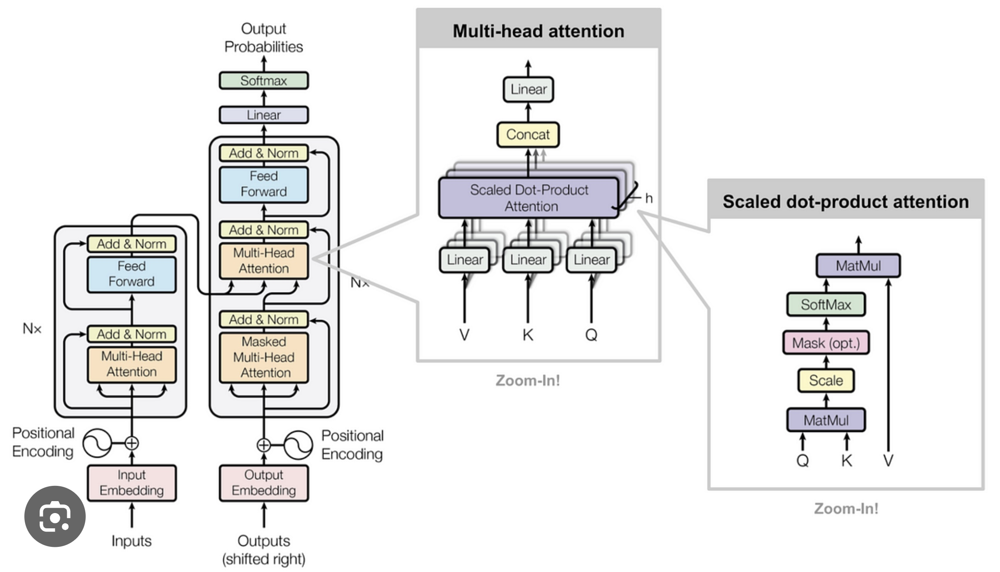

# Transformer for English-Italian Translation

## Project Overview

This project implements a Transformer model for English-Italian translation using the PyTorch framework. The training data is sourced from Hugging Face's translation dataset [Helsinki-NLP/opus_books](https://huggingface.co/datasets/Helsinki-NLP/opus_books).

## Architecture Diagram



## Dataset

The dataset used for this project is the English-Italian translation dataset from Hugging Face:
- **Dataset**: [Helsinki-NLP/opus_books](https://huggingface.co/datasets/Helsinki-NLP/opus_books)
- **Languages**: English (en) to Italian (it)

## Model Architecture

The project employs a Transformer model, which is highly effective for sequence-to-sequence tasks such as language translation. The model architecture includes:

- **Encoder**: Processes the source language (English) input.
- **Decoder**: Generates the target language (Italian) output.
- **Attention Mechanism**: Helps the model focus on relevant parts of the input sequence.

## Installation

To get started with this project, follow the instructions below:

### Prerequisites

- Python 3.6 or higher
- PyTorch
- Hugging Face `datasets` library

### Clone the Repository

```bash
git clone https://github.com/yourusername/transformer-with-pytorch
cd transformer-with-pytorch
